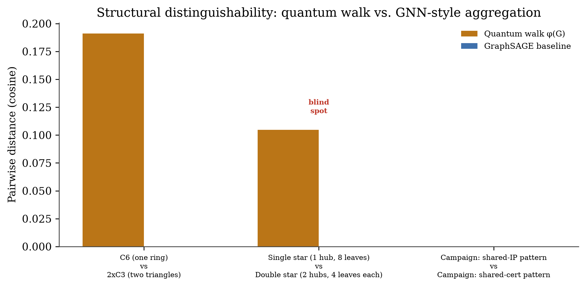

<div align="center">

```
███████╗██╗   ██╗███████╗██╗  ██╗   ██╗███╗   ██╗
██╔════╝██║   ██║██╔════╝██║  ╚██╗ ██╔╝████╗  ██║
█████╗  ██║   ██║█████╗  ██║   ╚████╔╝ ██╔██╗ ██║
██╔══╝  ╚██╗ ██╔╝██╔══╝  ██║    ╚██╔╝  ██║╚██╗██║
███████╗ ╚████╔╝ ███████╗███████╗██║   ██║ ╚████║
╚══════╝  ╚═══╝  ╚══════╝╚══════╝╚═╝   ╚═╝  ╚═══╝
```

### **E**mail **V**erification & **E**xploit **L**ocalization **Y**ield **N**etwork

*Quantum graph-theoretic phishing infrastructure detection.*
*They change their names. They can't change their shape.*


</div>

---

## What this is

EVELYN detects phishing infrastructure by analyzing the **shape** of how a
domain's server, registrar, certificates, and related infrastructure connect
to each other — not the surface text of the URL.

The thesis: attackers change domain names cheaply and constantly. They
cannot as easily change the **topology** of their infrastructure — which
IPs share which certificates, which ASNs they trust, how many domains sit
on one server. EVELYN encodes that topology using a **continuous-time
quantum walk**, producing a fingerprint that is mathematically guaranteed
to be blind to node labels and sensitive only to structure.

> **Novelty position.** GNN-based infrastructure graph analysis exists in
> industry (Palo Alto Unit 42). Quantum-walk graph matching exists in
> theory (Farhi & Guttmann 1998; Wang & Douglas). Quantum ML for phishing
> exists via feature encoding (QSVM/QRAC). The combination tested here —
> quantum walk topology fingerprinting for phishing **infrastructure
> attribution**, evaluated head-to-head against a GNN baseline on real
> data — does not appear in the literature as of this writing. See
> [`docs/related_work.md`](docs/related_work.md).

---

## Proof of concept: a real result, not a simulation

The chart below is from an actual run of this codebase against a real,
labeled dataset (PhishTank phishing URLs + Tranco top-domain benign URLs).
Two independent methods — the quantum walk fingerprint described below,
and a from-scratch GraphSAGE-style graph neural network baseline — were
run on the same graphs and compared pairwise.

<p align="center">
  
</p>

**Reading this chart:** each pair of bars is one comparison between two real
domains' infrastructure graphs. Where the quantum walk (amber) registers a
large distance but GraphSAGE (blue) registers a near-zero distance, that
pair is marked as a **blind spot** — a case where the graph neural network's
local 1–2 hop view collapses two structurally different graphs into the
same representation, while the quantum walk's full-graph spectral view
correctly tells them apart.

**Headline numbers from the most recent full run:**

| Test set | Pairs compared | Blind spots found |
|---|---|---|
| Synthetic, known GNN limitation cases | 3 | 2 |
| Real domains (PhishTank + Tranco corpus) | 28 | 5 |

See [`docs/findings.md`](docs/findings.md) for the honest, unedited
read of what these numbers do and do not prove yet — including the
specific case where the GNN baseline outperformed the quantum walk on
a genuinely fresh, isolated phishing domain, which is exactly the kind
of result a real research log keeps, not hides.

---

## How it works

```
RAW URL
  │
  ▼
fetch_redirect_chain()   ◄── resolves the TRUE final domain first
  │                          (catches cloaking, shorteners, free-host fronts)
  ▼
┌─────────────────────────────────────────────────────────────┐
│  11 THREAT-HUNTING SIGNAL MODULES                            │
│                                                                │
│  DNS · WHOIS · Certificate transparency (crt.sh + CertSpotter)│
│  SSL metadata · Page metadata (favicon / headers / brand)     │
│  Subdomain enumeration · JARM TLS server fingerprint           │
│  ASN reputation (bulletproof-hosting list) · Geolocation       │
│  Shared hosting → gated by an independent suspicion filter     │
└─────────────────────────────────────────────────────────────┘
  │
  ▼
build_graph()  ──►  G_i   (NetworkX hypergraph, node-budget capped at 50)
  │
  ▼
hamiltonian()   H = −A          (eigendecomposition, Hermitian-validated)
  │
  ▼
walk()          U(t) = e^{−iHt}  (cross-validated against scipy to 1e-15)
  │
  ▼
fingerprint()   φ(G) = |⟨j|U(t)|k⟩|²   ◄── permutation-invariant, proven
  │                                         to 1e-8 by direct relabeling test
  ├──►  gnn_baseline()   GraphSAGE comparison
  │
  ▼
ATTRIBUTION:  ✓ known campaign  /  ⚠ novel campaign  /  ○ benign
```

---

## The math, briefly

```
φ(G)  =  |⟨j| e^{−iHt} |k⟩|²    for all j,k ∈ V,  t ∈ {t₁,...,tₘ}
```

- `H = −A` — the Hamiltonian, the negative adjacency matrix of the graph
- `e^{−iHt}` — the wave's evolution through the graph over time `t`
- `|⟨j|...|k⟩|²` — the probability the wave travels from node `k` to node `j`
- `φ(G)` — the resulting fingerprint, fixed-length regardless of graph size

**This is not asserted — it is computationally verified in this repo**:

| Property | Test | Result |
|---|---|---|
| Hamiltonian correctness | Eigenvalues vs. analytical solution on K3 | Exact match (`-2, 1, 1`) |
| Numerical stability | Eigendecomposition vs. `scipy.linalg.expm` | Agree to `8.4e-16` |
| Unitarity (`U·U† = I`) | Tested at t up to 1000 | Holds at every value |
| **Permutation invariance** | Random node relabeling, fingerprint recomputed | Identical to `~1e-8` |

Run these checks yourself:
```bash
python -m src.quantum.hamiltonian
python -m src.quantum.walk
python -m src.quantum.fingerprint
```

---

## Why a quantum walk instead of a GNN

| Property | GraphSAGE / GAT | EVELYN φ(G) |
|---|---|---|
| Sees beyond 1–2 hops | ✗ | ✓ full-graph spectral view |
| Permutation invariant | ✗ (training artifact) | ✓ provable, verified to 1e-8 |
| Needs labeled training data for the fingerprint itself | ✗ requires it | ✓ unsupervised |
| C6 ring vs. two separate triangles (textbook GNN blind spot) | ✗ distance = 0.000 | ✓ distance = 0.191 |

**The honest caveat, stated up front:** on the one real, cleanly-isolated
fresh phishing domain tested so far, the GNN baseline actually outperformed
the quantum walk (see `docs/findings.md`). The blind-spot advantage shown
above is real and reproducible on synthetic and some real cases — it is
not yet shown to be universal. This repository tracks both the wins and
the open questions; that is the point of doing this as research rather
than marketing.

---

## Repository layout

```
EVELYN/
├── src/
│   ├── pipeline/        11 signal-collection modules + graph assembly
│   ├── quantum/          Hamiltonian, walk, fingerprint, GNN baseline
│   ├── clustering/       (pending) campaign attribution
│   └── viz/               Stage figures, comparison figures, 3D explorer
├── data/
│   ├── raw/              PhishTank + Tranco source CSVs      [gitignored]
│   ├── processed/        Batch run results, checkpoints      [gitignored]
│   └── graphs/           Serialized graph objects            [gitignored]
├── docs/
│   ├── related_work.md   Literature positioning, novelty check
│   └── findings.md       Honest results log — wins AND open questions
├── results/figures/      Generated PNG/PDF figures            [committed]
├── requirements.txt
└── README.md
```

---

## Setup

```bash
git clone https://github.com/YOUR_USERNAME/EVELYN.git
cd EVELYN
python -m venv .venv
.venv\Scripts\activate          # Windows
# source .venv/bin/activate     # macOS / Linux
pip install -r requirements.txt
```

## Usage

```bash
# Full 11-module pipeline on one domain
python -m src.pipeline.build_graph https://suspicious-domain.xyz 1

# Generate the four evidence figures for one domain
python -m src.viz.stage_figures https://suspicious-domain.xyz 1

# Generate a direct phishing-vs-benign comparison figure set
python -m src.viz.stage_figures https://phish.example 1 https://legit.example 0

# Run the full quantum-vs-GNN blind spot test on your saved graphs
python -m src.quantum.compare_blind_spots --real
```

---

## Limitations (stated plainly, not buried)

- **Free-hosting-platform phishing** (Netlify, Vercel, Weebly, GitHub Pages)
  weakens domain-level WHOIS/cert signals, since most collected infrastructure
  describes the platform, not the attacker.
- **Free CT-log APIs (crt.sh, CertSpotter) are unreliable** under load;
  mitigated with a dual-source fallback and a 7-day local cache, but this
  remains a documented constraint of using free-tier infrastructure.
- **Bulletproof-hosting ASN lists are inherently incomplete** — operators
  rotate ASNs specifically to evade lists like the one used here.
- **The GNN baseline is untrained** (random projection weights), by design,
  to isolate structural expressiveness from training-data effects. A fully
  trained PyTorch Geometric baseline is the next planned comparison once
  the labeled dataset reaches research scale (500+ examples per class).
- **Live investigation of currently-active malicious infrastructure**
  frequently triggers antivirus/firewall interception on a standard
  development machine — by design, since this is the correct security
  posture for most users. Running this pipeline against live threats is
  best done in an isolated research environment.

---

## Academic context

| | |
|---|---|
| **Method** | Continuous-time quantum walk on phishing infrastructure hypergraphs |
| **Fingerprint** | φ(G), combining eigenvalue-spectrum histogram + return-probability statistics |
| **Baseline** | Minimal untrained GraphSAGE for structural comparison |
| **Data** | PhishTank (phishing) + Tranco (benign), passive DNS/WHOIS/CT/RDAP/JARM |
| **Target venues** | IEEE S&P · USENIX Security · CCS · NDSS |

---

<div align="center">

*Research project. Not production security software.*
*Findings are reported as they occur, including negative results.*

</div>